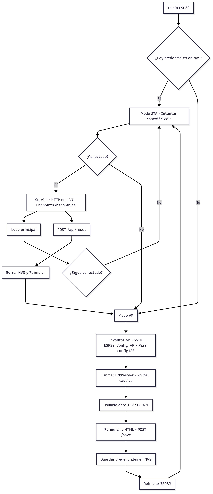
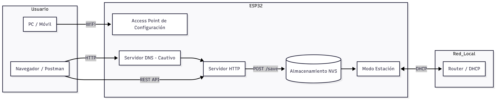
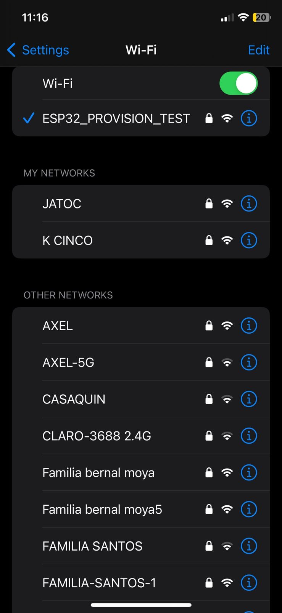

# Aprovisionamiento de Red WiFi con ESP32

## Descripción del Proyecto
Este proyecto implementa una solución IoT de **aprovisionamiento dinámico de red WiFi** utilizando el microcontrolador **ESP32**. El objetivo principal es eliminar la necesidad de reprogramar el firmware para cambiar las credenciales de red, facilitando la configuración por parte del usuario final.

El dispositivo puede iniciar en **modo Access Point (AP)** cuando no existen credenciales guardadas, mostrando un **portal cautivo web** donde el usuario final puede ingresar el **SSID** y **contraseña** de su red. Estas credenciales se almacenan en **memoria no volátil (NVS)** mediante `Preferences` y el ESP32 se reconecta automáticamente a la red configurada en posteriores reinicios. Una vez configurado, el dispositivo se conecta automáticamente a la red especificada en cada reinicio (modo Estación).


El sistema expone **endpoints HTTP** para monitoreo y gestión: estado, escaneo de redes y restablecimiento de configuración.

---

## Objetivos
- Configurar el ESP32 como **Access Point** en ausencia de credenciales.  
- Proporcionar una **interfaz web** amigable para capturar SSID y contraseña.  
- Guardar credenciales en **NVS (Preferences)**.  
- Reconectar automáticamente a la red configurada (**modo STA**).  
- Exponer **endpoints REST**: estado, escaneo WiFi y reset.
- Mecanismo de Reseteo: Es posible borrar las credenciales para reconfigurar el dispositivo
- Documentar diseño, funcionamiento, diagramas UML y validación funcional.  

---

## Requisitos

### Hardware
- ESP32 DevKit v1 o equivalente.  
- Cable USB de conexión.  
- Computador para carga de firmware.  

### Software
- Arduino IDE.  
- Núcleo ESP32 instalado en Arduino IDE.  
- Librerías incluidas en el núcleo ESP32:  
  - `WiFi.h`  
  - `WebServer.h`  
  - `DNSServer.h`  
  - `Preferences.h`  

---

## Estructura del Repositorio
```text
Aprovisionamiento-WiFi-ESP32
┣━ esp32_ap_config_no_reset.ino   # Código fuente principal
┣━ .gitattributes                 # Configuración de normalización de texto
┣━ README.md                      # Documentación del proyecto
┗━ Diagramas/                     # Diagramas PNG exportados (1.png .. 5.png)
```

---

## Funcionamiento del Sistema
1. **Inicio:** El ESP32 revisa si existen credenciales guardadas en NVS.  
2. **Si hay credenciales:** intenta conectarse en **modo STA**.  
3. **Si falla la conexión o no hay credenciales:** levanta un **AP de configuración** (`ESP32_Config_AP`, clave `config123`) y un **portal cautivo**.  
4. El usuario se conecta al AP y abre `http://192.168.4.1/` → formulario HTML.  
5. Tras guardar credenciales, el dispositivo reinicia y se conecta a la red configurada.  
6. Una vez conectado, los **endpoints** quedan disponibles desde la **IP asignada por el router**.  

---

## Endpoints Implementados

| Método | URL              | Descripción                                           | Headers / Query                         | Payload (ejemplo)                | Respuesta (ejemplo)                                                                 |
|-------:|------------------|-------------------------------------------------------|-----------------------------------------|----------------------------------|-------------------------------------------------------------------------------------|
| GET    | `/`              | Raíz. En **AP** devuelve formulario HTML; en **STA** devuelve estado JSON. | N/A                                     | N/A                              | `{"mode":"STA","ip":"192.168.1.45","connected":true,"saved_ssid":"ES****"}`         |
| POST   | `/save`          | Guarda SSID/Password enviados desde formulario y reinicia. | `Content-Type: application/x-www-form-urlencoded` | `ssid=MiRed&password=miClave`   | `{"result":"saved"}`                                                                 |
| GET    | `/api/status`    | Estado actual del dispositivo en JSON.                | `Accept: application/json`              | N/A                              | `{"mode":"AP","ip":"192.168.4.1","connected":false,"saved_ssid":""}`                |
| GET    | `/api/wifi-scan` | Escaneo de redes WiFi cercanas.                       | `Accept: application/json`              | N/A                              | `{"networks":[{"ssid":"MiRed","rssi":-55,"enc":4}, ...]}`                            |
| POST   | `/api/reset`     | Borra credenciales guardadas y reinicia el dispositivo. | (opcional) `Accept: application/json` | N/A                              | `{"result":"credentials_cleared"}`                                                   |

---

## Estructura del Código
- El código se organiza en las siguientes secciones lógicas:

- Gestión de Credenciales: Funciones como saveCredentials, loadCredentials y clearCredentials que interactúan con la librería Preferences para escribir, leer y borrar datos de la NVS.

- Interfaz Web (HTML): La función htmlPage() genera dinámicamente el código HTML y CSS de la interfaz de configuración, asegurando que no se necesiten archivos externos.

- Manejadores de Peticiones (Handlers): Funciones que gestionan las rutas del servidor web, como handleRoot, handleSave, handleStatus, handleScan y handleReset.

- Lógica de Conexión: Las funciones setup() y tryConnectStored() contienen la lógica principal para decidir si iniciar en modo AP o STA.

- Bucle Principal: La función loop() se encarga de procesar las peticiones del cliente web y del servidor DNS continuamente.


## Código Fuente Principal (`esp32_ap_config_no_reset.ino`)
```cpp
// esp32_ap_config_no_reset.ino
#include <WiFi.h>
#include <WebServer.h>
#include <DNSServer.h>
#include <Preferences.h>

// ===== Globals =====
WebServer server(80);
DNSServer dnsServer;
Preferences preferences;

const byte DNS_PORT = 53;

// Default AP credentials (used for configuration portal)
const char* ap_ssid = "ESP32_Config_AP";
const char* ap_pass = "config123";

// Captive portal HTML (simple form)
const char* captivePage = R"rawliteral(
<!DOCTYPE html><html><head><meta charset="utf-8"><meta name="viewport" content="width=device-width, initial-scale=1"></head>
<body>
  <h3>Configura la WiFi</h3>
  <form method="POST" action="/save">
    <label>SSID:</label><br>
    <input name="ssid" required><br>
    <label>Password:</label><br>
    <input name="password" type="password"><br>
    <button type="submit">Guardar y conectar</button>
  </form>
</body></html>
)rawliteral";

// Reconnect attempt timing
unsigned long lastAttempt = 0;
const unsigned long attemptInterval = 10000; // 10s

// ===== Helpers =====
// Escape " and \\ for safe JSON strings
String jsonEscape(const String &s) {
  String out;
  out.reserve(s.length() + 8);
  for (size_t i = 0; i < s.length(); ++i) {
    char c = s[i];
    if (c == '\\' || c == '"') {
      out += '\\';
      out += c;
    } else if (c == '\n') {
      out += "\\n";
    } else if (c == '\r') {
      out += "\\r";
    } else {
      out += c;
    }
  }
  return out;
}

bool hasSavedCredentials() {
  preferences.begin("wifi", true); // readonly
  String s = preferences.getString("ssid", "");
  preferences.end();
  return s.length() > 0;
}

bool connectToSavedNetwork(unsigned long timeoutMs = 15000) {
  preferences.begin("wifi", true);
  String savedSsid = preferences.getString("ssid", "");
  String savedPass = preferences.getString("pass", "");
  preferences.end();

  if (savedSsid.length() == 0) return false;

  Serial.printf("Intentando conectar a SSID: %s\n", savedSsid.c_str());
  WiFi.mode(WIFI_STA);
  WiFi.begin(savedSsid.c_str(), savedPass.c_str());

  unsigned long start = millis();
  while (millis() - start < timeoutMs) {
    if (WiFi.status() == WL_CONNECTED) {
      Serial.println("Conectado a la red guardada.");
      Serial.print("IP: ");
      Serial.println(WiFi.localIP());
      // Ensure DNS server stops when we become STA
      dnsServer.stop();
      return true;
    }
    delay(200);
  }

  Serial.println("No se pudo conectar a la red guardada (timeout)." );
  return false;
}

// ===== Handlers =====
void handleStatus() {
  bool connected = (WiFi.status() == WL_CONNECTED);
  String ip = (connected ? WiFi.localIP().toString() : WiFi.softAPIP().toString());

  preferences.begin("wifi", true);
  String s = preferences.getString("ssid", "");
  preferences.end();

  String masked = "";
  if (s.length()) {
    masked = s;
    if (masked.length() > 2) masked = masked.substring(0,2) + String("****");
    masked = jsonEscape(masked);
  }

  // Build JSON manually
  String out;
  out.reserve(200);
  out += "{";
  out += "\"mode\":\"";
  out += (connected ? "STA" : "AP");
  out += "\",";
  out += "\"ip\":\"";
  out += jsonEscape(ip);
  out += "\",";
  out += "\"connected\":";
  out += (connected ? "true" : "false");
  out += ",";
  out += "\"saved_ssid\":\"";
  out += masked;
  out += "\"";
  out += "}";

  server.send(200, "application/json", out);
}

void handleWiFiScan() {
  int n = WiFi.scanNetworks(); // blocking scan
  if (n < 0) n = 0;

  // Build JSON array
  String out;
  out.reserve(1024);
  out += "{\"networks\":[";

  for (int i = 0; i < n; ++i) {
    String ssid = jsonEscape(WiFi.SSID(i));
    int rssi = WiFi.RSSI(i);
    int enc = WiFi.encryptionType(i);

    out += "{";
    out += "\"ssid\":\""; out += ssid; out += "\",";
    out += "\"rssi\":"; out += String(rssi); out += ",";
    out += "\"enc\":"; out += String(enc);
    out += "}";
    if (i < n - 1) out += ",";
  }

  out += "]}";

  server.send(200, "application/json", out);
}

void handleReset() {
  Preferences pref;
  pref.begin("wifi", false);
  pref.clear();
  pref.end();
  server.send(200, "application/json", "{\"result\":\"credentials_cleared\"}");
  delay(500);
  ESP.restart();
}

// This root handler behaves as portal root if in AP mode, otherwise shows status JSON
void handleRoot() {
  if (WiFi.getMode() == WIFI_AP) {
    server.send(200, "text/html", captivePage);
  } else {
    handleStatus();
  }
}

// Save handler: only valid when in AP mode (portal). Otherwise returns 404-like JSON.
void handleSave() {
  if (WiFi.getMode() != WIFI_AP) {
    server.send(400, "application/json", "{\"error\":\"not in AP mode\"}");
    return;
  }
  if (server.hasArg("ssid")) {
    String s = server.arg("ssid");
    String p = server.arg("password");

    Preferences pref;
    pref.begin("wifi", false);
    pref.putString("ssid", s);
    pref.putString("pass", p);
    pref.end();

    server.send(200, "application/json", "{\"result\":\"saved\"}");

    delay(500);
    ESP.restart(); // restart to attempt STA connection
  } else {
    server.send(400, "application/json", "{\"error\":\"missing fields\"}");
  }
}

// NotFound: when in AP redirect everything to portal root; else return default 404
void handleNotFound() {
  if (WiFi.getMode() == WIFI_AP) {
    server.sendHeader("Location", String("http://") + WiFi.softAPIP().toString(), true);
    server.send(302, "text/plain", "");
  } else {
    server.send(404, "text/plain", "Not Found");
  }
}

// ===== Setup & Loop =====
void startAPAndCaptivePortal() {
  WiFi.mode(WIFI_AP);
  WiFi.softAP(ap_ssid, ap_pass);
  delay(500);
  IPAddress apIP = WiFi.softAPIP();
  dnsServer.start(DNS_PORT, "*", apIP);
  Serial.print("Captive portal AP started. IP: ");
  Serial.println(apIP);
}

void setup() {
  Serial.begin(115200);
  delay(1000);

  Serial.println("=== ESP32 WiFi Config Starting ===");

  // Register routes once
  server.on("/", handleRoot);
  server.on("/save", HTTP_POST, handleSave);
  server.on("/api/status", HTTP_GET, handleStatus);
  server.on("/api/wifi-scan", HTTP_GET, handleWiFiScan);
  server.on("/api/reset", HTTP_POST, handleReset);
  server.onNotFound(handleNotFound);

  server.begin();

  // Boot decision: try STA if saved credentials, else AP portal
  if (hasSavedCredentials()) {
    if (connectToSavedNetwork(10000)) {
      Serial.println("Booted in STA mode; API available.");
      // DNS server already stopped inside connectToSavedNetwork() on success
      return;
    } else {
      Serial.println("Fallo al conectar con credenciales guardadas. Iniciando portal configuracion.");
    }
  } else {
    Serial.println("No hay credenciales guardadas. Iniciando portal configuracion.");
  }

  startAPAndCaptivePortal();
}

void loop() {
  server.handleClient();
  if (WiFi.getMode() == WIFI_AP) {
    dnsServer.processNextRequest();
  }

  // If we have saved credentials but are not connected, attempt reconnect every interval
  if (!WiFi.isConnected() && hasSavedCredentials()) {
    if (millis() - lastAttempt > attemptInterval) {
      lastAttempt = millis();
      Serial.println("Intento de reconexión a credenciales guardadas...");
      if (connectToSavedNetwork(10000)) {
        Serial.println("Reconectado en loop; API disponible en STA mode.");
        // If we were an AP previously, stop DNS server to clean up captive behavior
        dnsServer.stop();
      }
    }
  }
}
```

---

## Diagramas del Sistema

### 1. Diagrama de Flujo General


### 2. Arquitectura del Firmware


### 3. Conexión Usuario–Dispositivo


### 4. Diagrama de Estados


### 5. Diagrama de Secuencia (UML)


---

## Validación Funcional

### Mensajes esperados en Serial Monitor
```text
=== ESP32 WiFi Config Starting ===
No hay credenciales guardadas. Iniciando portal configuracion.
Captive portal AP started. IP: 192.168.4.1
Booted in STA mode; API available.
```

### Validación Funcional
  Paso 1: Conexión al Access Point
  Al iniciar sin credenciales, el ESP32 crea la red ESP32_PROVISION_TEST. Nos conectamos a ella desde un dispositivo móvil.
  | Conexión a la red | Detalles de la red AP |
  
  

  

  Paso 2: Acceso al Portal Cautivo y Escaneo de Redes
  Al conectarse, se accede a la IP 192.168.4.1. La interfaz permite escanear las redes WiFi disponibles, mostrando el resultado en formato JSON.
  | Portal de Configuración | Resultado del Escaneo | Log del Monitor Serie |
  

  


  
  Paso 3: Envío de Credenciales
  Se introducen el SSID y la contraseña de la red local y se presiona "Save & Connect". El monitor serie confirma la recepción de los datos a través del endpoint /save.
  | Formulario con datos | Log del Monitor Serie |
  
  
  
  
  Paso 4: Verificación de Estado y Restablecimiento
  Una vez conectado en modo STA, se puede consultar el endpoint /status para verificar la conexión. Finalmente, se prueba la función de reseteo, la cual solicita confirmación y limpia la NVS, reiniciando el portal.
  | Diálogo de reseteo | Log del Monitor Serie |
  
  


### Prueba de Conectividad
1) Conectarse a la red AP `ESP32_Config_AP` (clave `config123`).  
2) Abrir `http://192.168.4.1/` y completar el formulario.  
3) Guardar credenciales y esperar reinicio.  
4) Consultar `/api/status` en la IP local para verificar conexión.  

**Criterios de aceptación:**
- El AP se crea si no existen credenciales o si falla la conexión.  
- El formulario `/save` permite guardar credenciales.  
- Los endpoints `/api/status` y `/api/wifi-scan` responden en JSON.  
- El endpoint `/api/reset` restablece la configuración y reinicia.  

---

## Documentación Técnica

### Arquitectura y responsabilidades
- **ESP32 (AP/STA):** gestiona WiFi y cambia de modo según credenciales.  
- **WebServer:** sirve portal y endpoints REST.  
- **DNSServer:** redirige el tráfico en modo AP (comportamiento cautivo).  
- **Preferences (NVS):** almacena SSID y contraseña de forma persistente.  

### Consideraciones de diseño
- El SSID guardado se **enmascara** en `/api/status` para no exponerlo completo.  
- **Reconexiones periódicas** (10 s) si hay credenciales pero no conexión.  
- Se **detiene DNSServer** al pasar a STA para evitar comportamientos no deseados.  

### Extensibilidad futura
- Mejorar UI del portal (estilos/validaciones).  
- Autenticación para endpoints sensibles.  
- Integración con MQTT o plataformas IoT.  


